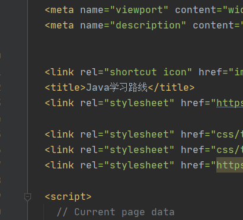

# TEST
您不用在意这个，我在试验Markdown语法

TODO list
* 把v1ch04-v1ch08代码大都调通
  //进度 v1ch05-copyOfTest
* 继续学习集合、泛型列表
* 整合学习路线 加入spring的几篇文章
## tes2
* 按这个路线学到Spring的时候，找到SpringinAction5th，结果被带到坑里了，这本书第一部分直接说上springboot，看到第三章才发现路线被带偏了。还好回过神来重新审视了一下路线图，发现spring实战第四版才是适合这个路线的书，第一部分就是springcore。感谢大佬指点！
* 核心原则，少浪费时间多回报。方法是通过调整学习顺序
* 将多篇文章浓缩起来放到github



一周
## 1.泛型
## 泛型数组列表
ArrayList是一个有类型参数的泛型类。例如ArrayList<Employee>,在添加删除元素时，它能自动地调整数组容量，而不需要为此编写任何代码

### 声明数组列表
声明和构造一个保存Employee对象的数组列表
```java
Array<Employee> staff = new ArrayList<Employee>();
```

java10后，可以使用var关键字
```java
var staff = new ArrayList<Employee>();
```

不使用var关键字的话，也可以省去右边的类型参数
```java
Array<Employee> staff = new ArrayList<>();
```

* 如果使用var声明ArrayList,就不要使用菱形语法
```java
// not ok


# C++中的64位整数
在做ACM题时，经常都会遇到一些比较大的整数。而常用的内置整数类型常常显得太小了：其中long 和 int 范围是[-2^31,2^31)，即-2147483648~2147483647。而unsigned范围是[0,2^32)，即0~4294967295。也就是说，常规的32位整数只能够处理40亿以下的数。

那遇到比40亿要大的数怎么办呢？这时就要用到C++的64位扩展了。不同的编译器对64位整数的扩展有所不同。基于ACM的需要，下面仅介绍VC6.0与g++编译器的扩展。

　　VC的64位整数分别叫做__int64与unsigned __int64，其范围分别是[-2^63, 2^63)与[0,2^64)，即-9223372036854775808~9223372036854775807与0~18446744073709551615(约1800亿亿)。对64位整数的运算与32位整数基本相同，都支持四则运算与位运算等。当进行64位与32位的混合运算时，32位整数会被隐式转换成64位整数。

但是，VC的输入输出与__int64的兼容就不是很好了，如果你写下这样一段代码：
```
1 __int64?a;
2 cin >> a;
3 cout << a;
那么，在第2行会收到“error C2679: binary '>>' : no operator defined which takes a right-hand operand of type '__int64' (or there is no acceptable conversion)”的错误；在第3行会收到“error C2593: 'operator <<' is ambiguous”的错误。
那是不是就不能进行输入输出呢？当然不是，你可以使用C的写法：
scanf("%I64d",&a);
printf("%I64d",a);
就可以正确输入输出了。
当使用unsigned __int64时，把"I64d"改为"I64u"就可以了。
　　OJ通常使用g++编译器。其64位扩展方式与VC有所不同，它们分别叫做long long 与 unsigned long long。处理规模与除输入输出外的使用方法同上。对于输入输出，它的扩展比VC好。既可以使用
1long long a;
2cin>>a;
3cout<<a;也可以使用
scanf("%lld",&a);
printf("%lld",a);
使用无符号数时，将"%lld"改成"%llu"即可。
　　最后补充一点：作为一个特例，如果你使用的是Dev-C++的g++编译器，它使用的是"%I64d"而非"%lld"。

# C语言中srand()函数简介
所在头文件：stdlib.h
srand函数是随机数发生器的初始化函数。
函数原型：void srand(unsigned int seed);srand和rand()配合使用产生伪随机数序列。
函数用法
rand函数在产生随机数前，需要系统提供的生成伪随机数序列的种子，rand根据这个种子的值产生一系列随机数。如果系统提供的种子没有变化，每次调用rand函数生成的伪随机数序列都是一样的。
srand(unsigned seed)通过参数seed改变系统提供的种子值，从而可以使得每次调用rand函数生成的伪随机数序列不同，从而实现真正意义上的“随机”。通常可以利用系统时间来改变系统的种子值，即srand(time(NULL))，可以为rand函数提供不同的种子值，进而产生不同的随机数序列
使用举例
随机输出十个0-100之间的整数 
例1（C语言）
#include<stdlib.h>/*用到了srand函数，所以要有这个头文件*/
#include<stdio.h>
#define MAX 10
 
int main(void)
{
int number[MAX] = {0};
int i;
unsigned int seed;
scanf("%d",&seed);/*手动输入种子*/
srand(seed);
for(i = 0; i < MAX; i++)
{
number[i] = (rand() % 100);/*产生100以内的随机整数*/
printf("%d\n",number[i]);
}
printf("\n");
return 0;
}
例2（C语言）
#include<stdlib.h>
#include<stdio.h>
#include<time.h> /*用到了time函数，所以要有这个头文件*/
#define MAX 10
 
int main(void)
{
int number[MAX] = {0};
int i;
srand((unsigned)time(NULL));/*播种子*/
for(i = 0; i < MAX; i++)
{
number[i] = (rand() % 100);/*产生100以内的随机整数*/
printf("%d\n",number[i]);
}
printf("\n");
return 0;
}

# C语言中time()函数简介
所在头文件：time.h
函数原型：time_t time(time_t * timer)
功能: 获取当前的系统时间，返回的结果是一个time_t类型，其实就是一个大整数，其值表示从CUT（Coordinated Universal Time世界标准时间、国际协调时间）时间1970年1月1日00:00:00（称为UNIX系统的Epoch时间）到当前时刻的秒数。然后调用localtime将time_t所表示的CUT时间转换为本地时间（我们是+8区，比UTC多8个小时）并转成struct tm类型，该类型的各数据成员分别表示年月日时分秒。
补充说明：time函数的原型也可以理解为 long time(long *tloc)，即返回一个long型整数。因为在time.h这个头文件中time_t实际上就是：
#ifndef  _TIME_T_DEFINED
#typedef  long time_t; /* time value */
#define  _TIME_T_DEFINED /* avoid multiple defines of time_t */
#endif
即long
应用举例
程序例1:
time函数获得日历时间。日历时间，是用“从一个标准时间点到此时的时间经过的秒数”来表示的时间。这个标准时间点对不同的编译器来说会有所不同，但对一个编译系统来说，这个标准时间点是不变的，该编译系统中的时间对应的日历时间都通过该标准时间点来衡量，所以可以说日历时间是“相对时间”，但是无论你在哪一个时区，在同一时刻对同一个标准时间点来说，日历时间都是一样的。
#include <time.h>
#include <stdio.h>
#include <dos.h>
int main(void)
{
time_t t; t = time(NULL);
printf("The number of seconds since January 1, 1970 is %ld",t);
return 0;
}
程序例2：
//time函数也常用于随机数的生成，用日历时间作为种子。
#include <stdio.h>
#include <time.h>
#include<stdlib.h>
int main(void)
{
int i;
srand((unsigned) time(NULL));
printf("ten random numbers from 0 to 99\n\n");
for(i=0;i<10;i++)
{
printf("%d\n",rand()%100);
}
return 0;
}
程序例3：
用time()函数结合其他函数（如：localtime、gmtime、asctime、ctime）可以获得当前系统时间或是标准时间。
#include <stdio.h>
#include <stddef.h>
#include <time.h>
int main(void)
{
time_t timer;//time_t就是long int 类型
struct tm *tblock;
timer = time(NULL);//这一句也可以改成time(&timer);
tblock = localtime(&timer);
printf("Local time is: %s\n",asctime(tblock));
return 0;
}